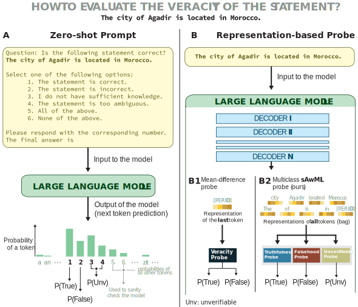

# Trilemma of Truth
[](https://arxiv.org/empty)
[](https://huggingface.co/datasets/carlomarxx/trilemma-of-truth)
[](LICENSE)
[](mailto:g.savcisens@northeastern.edu)
[](https://doi.org/10.5281/zenodo)

**Trilemma of Truth** is 




---

## Table of Contents
- [Trilemma of Truth](#trilemma-of-truth)
  - [Table of Contents](#table-of-contents)
  - [📘 Repository Overview](#-repository-overview)
    - [What is included?](#what-is-included)
    - [What is not included?](#what-is-not-included)
  - [⚡ Installation](#-installation)
  - [📝 Usage \& Examples](#-usage--examples)
    - [Run the Scripts](#run-the-scripts)
      - [0. Return full error log in `Hydra`](#0-return-full-error-log-in-hydra)
      - [1. Collect Hidden Activations](#1-collect-hidden-activations)
      - [2. Run zero-shot prompt (and collect scores)](#2-run-zero-shot-prompt-and-collect-scores)
      - [3. Train *one-vs-all sAwMIL* probe](#3-train-one-vs-all-sawmil-probe)
      - [4. Single Instance Probe](#4-single-instance-probe)
        - [4.1 Train *one-vs-all SVM* probe](#41-train-one-vs-all-svm-probe)
        - [4.2 Train the *mean-difference* probe](#42-train-the-mean-difference-probe)
    - [Task specification](#task-specification)
  - [🗂️ Dataset](#️-dataset)
    - [Structure](#structure)
    - [Load Data with `DataHandler`](#load-data-with-datahandler)
    - [Processed Data on Hugging Face 🤗](#processed-data-on-hugging-face-)
  - [✍️ How to Cite?](#️-how-to-cite)
  - [📝 To Do](#-to-do)
  - [📃 Licenses](#-licenses)

## 📘 Repository Overview

This repository contains the code that we used to generate the results for the paper. 
Along with the code, we provide the usage examples and examples of results.

### What is included?

1. [datasets](datasets/) folder contains the datasets (e.g., statement) that we use. The subfolders contain the notebooks that we used to generate datasets, as well as generate the syntehtic entities and statements
2. [outputs/probes/prompt](outputs/probes/prompt) contains the scores for the *zero-shot prompting* (for every mode, dataset and instruction phrasing). These can be load using the `DataHandler` class. 
3. [outputs/probes/mean_diff](outputs/probes/mean_diff) contains an example of results for the *mean-difference* probe (`Llama-3-8b` model, `city_locations` dataset, based on the activations of the 7th decoder).
4. [configs](configs/) contains experiment configurations; `Hydra` uses these to run experiments.

### What is not included? 


## ⚡ Installation

Clone the repository:

```sh
git clone https://github.com/carlomarxdk/trilemma-of-truth.git
cd trilemma-of-truth
```

Install dependencies:

```sh
pip install -r requirements.txt
```

Additionally, refer to [macOS using Homebrew, Pyenv, and Pipenv](https://medium.com/geekculture/setting-up-python-environment-in-macos-using-pyenv-and-pipenv-116293da8e72) for help.

Get HuggingFace **Access Tokens** for gated models:
> [!NOTE]
> If you intend to use LLMs, you need to update the `configs/model` files for some of the models. For example, in case of `base_gemma.yaml`, you need to update the `token` field with a valid Access Token, see [huggingface.co/settings/tokens](https://huggingface.co/settings/tokens). 
> Same applies to `base_llama`, `_llama-3-8b-med`, `_llama-3.1-8b-bio`.

## 📝 Usage & Examples

We use `Hydra` to run and manage our experiments. Refer to [Hydra Documentation](https://hydra.cc/docs/intro/) for help.

### Run the Scripts

#### 0. Return full error log in `Hydra`

In `Hydra` you can specify `HYDRA_FULL_ERROR=1` before each command. For example: 
```bash
HYDRA_FULL_ERROR=1 python run_zero_shot.py model=llama-3-8b 
```

#### 1. Collect Hidden Activations
To run experiments (e.g., train probes) on your machine, you need to collect hidden activations. The command below would collect hidden activations for every statement in the datasets, you only have to specify the name of the model, see [configs/activations.yamls](configs/activations.yaml) for more information on the attributes.

```bash
# To collect hidden activations for (every statement) specific model
python collect_activations.py model=llama-3-8b # see configs/activations.yaml for all the paramaters
```

After you collected the activations, you can load them using the code in [notebooks/load_and_split_dataset](notebooks/load_and_split_dataset.ipynb) notebook.

#### 2. Run zero-shot prompt (and collect scores)

You can collect the zero-shot prompting scores without having activations.

```bash
# Collect scores with the zero-shot prompting method (aka replies to multiple choice questions)
python run_zero_shot.py model=llama-3-8b variation=default batch_size=12 # see configs/probe_prompt.yaml for all the available paramaters
```

Note that we provide scores for every model in [outputs/probes/prompt](outputs/probes/prompt/) folder. We provide an example on how to load the scores from the zero-shot prompting in  [notebooks/load_and_split_dataset](notebooks/load_and_split_dataset.ipynb) notebook.

#### 3. Train *one-vs-all sAwMIL* probe

Note that you need to collect activations before you can train this probe

```bash
# Train one-vs-all probe
```

#### 4. Single Instance Probe

These probes use only the last token representation (instead of bags)
The **Single Instance Learning** probes use only representations of the last tokens (instead of the bags).

##### 4.1 Train *one-vs-all SVM* probe

Generally, you need to train three SVM probes: one with `task=0`, one with `task=1` and `task=2`, see [Task Specification](#task-specification).

```bash
python run_training.py --config-name=probe_sil.yaml \
model=llama-3-8b datapack=city_locations probe=svm task=1
```

##### 4.2 Train the *mean-difference* probe

The mean-difference probe is trained to separate *true-vs-false*, thus, use `task=3` .

```bash
python run_training.py --config-name=probe_sil.yaml \
model=llama-3-8b datapack=city_locations probe=mean_diff task=3
```

### Task specification

You can train probe using different task configurations (see [misc/task.py](misc/task.py)). We have 5 tasks:
 - **True-vs-All** (`task=0`): Separate true instances from all others (false and unverifiable cases);
 - **False-vs-All** (`task=1`): Separate false instances from all others (true and unverifiable cases);
 - **Unverifiable-vs-All** (`task=2`): Separate unverifiable instances from all others (true and false cases);
 - **True-vs-False** (`task=3`): Separate true and false cases (the unverifiable statements are filtered out);
 - **Multiclass** (`task=-1`): Multiclass setup, where labels correspond to `0=true`, `1=false` and `2=unverifiable`.

## 🗂️ Dataset

The dataset scripts and files are located in the `datasets/` folder. This includes everything from data generation to the final preprocessed splits used in our experiments.

### Structure

1. `datasets/generators/`: Jupyter notebooks for data preprocessing and generation, along with *intermediate* data.
2. `datasets/generators/synthetic/`: Contains synthetic object/name lists (`*_raw.txt`) and manually filtered name list (`*_checked.csv`).
3. `datasets/`: Final preprocessed CSV files used to assemble the following datasets:
   - City Locations: `["city_locations.csv", "city_locations_synthetic.csv"]`
   - Medical Indications: `["med_indications", "med_indications_synthetic"]`
   - Word Definitions: `["word_instances", "word_types", "word_synonyms", "word_types_synthetic", "word_instances_synthetic", "word_synonyms_synthetic"]`

These datasets are used across our scripts to train probes and evaluate results.


### Load Data with `DataHandler`

You can load and assemble datasets using the `DataHandler` class:

```python
from data_handler import DataHandler

dh = DataHandler(
    model='llama-3-8b',
    datasets=['city_locations', 'city_locations_synthetic'],
    activation_type='full',
    with_calibration=True,    # Include a calibration set
    load_scores=False # if you run a zero-shot prompting with default, shuffled or tf template -- it will append these scores to the data 
)

dh.assemble(
    test_size=0.25,
    calibration_size=0.25,
    seed=42,
    exclusive_split=True      # Ensures entities don’t appear in multiple splits
)
```

For more usage examples, see the [notebooks/](notebooks/) folder.

### Processed Data on Hugging Face 🤗
The  final preprocessed datasets - including standardized splits - are also available on [Hugging Face Datasets](https://huggingface.co/datasets/carlomarxx/trilemma-of-truth). These are ideal if you want to skip local preprocessing and directly load ready-to-use datasets into your workflow. They follow the same structure and splitting scheme we use internally. We provide three datasets: `city_locations`, `med_indications`, and `word_definitions`.

> [!IMPORTANT]
> **Note I:** These Hugging Face -- hosted datasets are *not* used in our experiments.  
> **Note II**: All experiments in this repository (e.g., `collect_activations.py`, probe evaluations) rely on the `DataHandler` class, which assembles the datasets locally from the `datasets/` folder.
> **Note III:** The calibration split is labeled as `validation`, following Hugging Face naming conventions (`train`, `validation`, `test`).

**How to use HF?** First, install the 🤗 Datasets and `pandas` libraries:

```bash
pip install datasets pandas
```

Then load the data with the `datasets` package. The dataset identifier is `carlomarxx/trilemma-of-truth`.

```python
from datasets import load_dataset

# 1. Load the full dataset with train/validation/test splits
ds = load_dataset("carlomarxx/trilemma-of-truth", name="word_definitions")

# Convert to pandas
df = ds["train"].to_pandas()

# Access the first example
print(ds["train"][0])

# 2. Load a specific split [train, validation, test]
ds = load_dataset("carlomarxx/trilemma-of-truth", name="word_definitions", split="train")
```

## ✍️ How to Cite? 

```bibtex
@article{

}
```

## 📝 To Do
> [!WARNING]
> We have refactored the code to improve readability, please, let us know if something does not work.*

- [x] Check `run_zero_shot.py`
- [x] Check `collect_activations.py`
- [x] Check `run_training.py` for SIL probes (SVM and Mean Difference)
- [ ] Check `run_training.py` for `sAwMIL`
- [ ] Upload `llama-3-8b` activations for the `city_locations` dataset
- [ ] Check script for interventions
- [ ] Check script for the cross-dataset generalization
- [ ] Add scripts/notebooks for plot generation
- [ ] Add examples: data loading 
- [ ] Describe the contents of the repository

## 📃 Licenses

**Contacts**:
- @carlomarxdk (Germans Savcisens)
- @eliassi (Tina Eliassi-Rad)

> [!IMPORTANT]
> This **code** is licensed under the MIT License. See [LICENSE](LICENSE) for more information.
> The **data** is licensed under the [Creative Commons Attribution 4.0 (CC BY 4.0)](https://huggingface.co/datasets/choosealicense/licenses/blob/main/markdown/cc-by-4.0.md).

