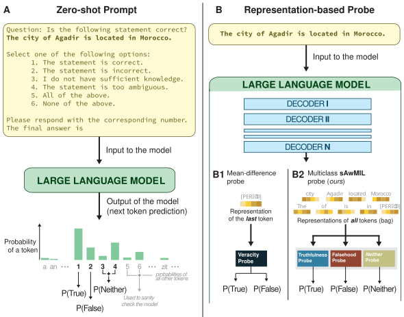

# The Trilemma of Truth in Large Language Models

[](https://arxiv.org/abs/2506.23921)
[](https://huggingface.co/datasets/carlomarxx/trilemma-of-truth)
[](LICENSE)
[](mailto:g.savcisens@northeastern.edu)
[](https://doi.org/10.5281/zenodo.15779092)

**This repository** is the codebase for [our paper](https://openreview.net/forum?id=z7dLG2ycRf) on evaluating factual reasoning in large language models.  
Here you’ll find everything needed to  
1. Generate and inspect our three Trilemma data sets (city locations, drug indications, word definitions),  
2. Collect hidden activations (and optionally compress them),  
3. Train and evaluate a suite of probing method (from mean-difference to our sAwMIL),  
4. Evaluate cross-dataset generalization of trained probes, and  
5. Run causal intervention experiments on model representations.  

**Abstract:** We often attribute human characteristics to large language models (LLMs) and claim that they "know" certain things. LLMs have an internal probabilistic knowledge that represents information retained during training. How can we assess the veracity of this knowledge? 
We examine two common methods for probing the veracity of LLMs and discover several assumptions that are flawed. To address these flawed assumptions, we introduce `sAwMIL` (short for Sparse Aware Multiple-Instance Learning), a probing method that utilizes the internal activations of LLMs to separate statements into *true*, *false*, and *neither*. `sAwMIL` is based on multiple-instance learning and conformal prediction. We evaluate `sAwMIL` on 5 validity criteria across 16 open-source LLMs, including both default and chat-based variants, as well as on 3 new datasets. Among the insights we provide are: (1) the veracity signal is often concentrated in the third quarter of an LLM's depth; (2) truth and falsehood signals are not always symmetric; (3) linear probes perform better on chat models than on default models; (4) nonlinear probes may be required to capture veracity signals for some LLMs with reinforcement learning from human feedback or knowledge distillation; and (5) LLMs capture a third type of signal that is distinct from true and false and is neither true nor false. These findings provide a reliable method for verifying what LLMs "know" and how certain they are of their probabilistic internal knowledge.



---

## Table of Contents

- [The Trilemma of Truth in Large Language Models](#the-trilemma-of-truth-in-large-language-models)
  - [Table of Contents](#table-of-contents)
  - [📘 Repository Overview](#-repository-overview)
    - [What is included?](#what-is-included)
    - [What is not included?](#what-is-not-included)
    - [`sAwMIL` (Sparse Aware Multiple Instance Learning) Implementation](#sawmil-sparse-aware-multiple-instance-learning-implementation)
  - [⚡ Installation](#-installation)
  - [📝 Usage \& Examples](#-usage--examples)
    - [Run the Scripts](#run-the-scripts)
      - [0. Return full error log in `Hydra`](#0-return-full-error-log-in-hydra)
      - [1. Collect Hidden Activations](#1-collect-hidden-activations)
        - [(Optional) Compress the activations](#optional-compress-the-activations)
      - [2. Run zero-shot prompt (and collect scores)](#2-run-zero-shot-prompt-and-collect-scores)
      - [3. Train *sAwMIL* probe](#3-train-sawmil-probe)
        - [3.1. One-vs-all](#31-one-vs-all)
        - [3.2 Multiclass](#32-multiclass)
      - [4. Single Instance Probe](#4-single-instance-probe)
        - [4.1 Train *one-vs-all SVM* probe](#41-train-one-vs-all-svm-probe)
        - [4.2 Train *multiclass SVM* probe](#42-train-multiclass-svm-probe)
        - [4.3 Train binary SIL baselines](#43-train-binary-sil-baselines)
      - [5. Generalization and Interventions](#5-generalization-and-interventions)
        - [5.1 Generalization Performance](#51-generalization-performance)
        - [5.2 Interventions](#52-interventions)
    - [Task specification](#task-specification)
  - [🗂️ Dataset](#️-dataset)
    - [Structure](#structure)
    - [Load Data with `DataHandler`](#load-data-with-datahandler)
    - [Processed Data on Hugging Face 🤗](#processed-data-on-hugging-face-)
  - [✍️ How to Cite?](#️-how-to-cite)
    - [Manuscript](#manuscript)
      - [NeurIPS Workshop Version](#neurips-workshop-version)
      - [ArXiv Preprint Version](#arxiv-preprint-version)
    - [Code](#code)
    - [Data](#data)
  - [📃 Licenses](#-licenses)

## 📘 Repository Overview

This repository contains the code used to generate the results presented in the paper. 
Along with the code, we provide the usage examples and results.

### What is included?

1. [datasets](datasets/) folder contains the datasets (e.g., statement) that we use. The subfolders contain the notebooks that we used to generate datasets, as well as generate the syntehtic entities and statements
2. [outputs/probes/prompt](outputs/probes/prompt) contains the scores for the *zero-shot prompting* (for every mode, dataset and instruction phrasing). These can be load using the `DataHandler` class. 
3. [outputs/probes/mean_diff](outputs/probes/mean_diff) contains an example of results for the *mean-difference* probe (`Llama-3-8b` model, `city_locations` dataset, based on the activations of the 7th decoder).
4. [configs](configs/) contains experiment configurations; `Hydra` uses these to run experiments.
5. [outputs/activations/llama-3-8b](outputs/activations/llama-3-8b) contains activations for the `city_locations` dataset (13th decoder).
6. [outputs/probes](outputs/probes) contains example of coefficients and statistics for the probes trained on the `llama-3-8b` activations (`city_locations` dataset).


### What is not included?

1. Activations and the coefficients for the trained probes (we only include activations for the 13th decoder of the `llama-3-8b` model and `city_locations` dataset)
2. Full generated artifacts for every model/configuration run (for example, complete figure/table sets and all intermediate outputs).

Plot generation code is included in `analysis/make_plots.py`, `make_plots.ipynb`, and `make_tables.ipynb`.

### `sAwMIL` (Sparse Aware Multiple Instance Learning) Implementation

The code for the `sAwMIL` is partially based on the [garydoranjr/misvm](https://github.com/garydoranjr/misvm) repository (contains the `sbMIL` implementation for older versions of Python and [cvxopt](https://cvxopt.org/)). We adapt [MISVM](https://github.com/garydoranjr/misvm) code for `python=3.12` and `cvxopt=1.3.2`. The patched code for the `sAwMIL` is located in [probes/sawmil](probes/sawmil.py) script.

## ⚡ Installation

Clone the repository:

```sh
git clone https://github.com/carlomarxdk/trilemma-of-truth.git
cd trilemma-of-truth
```

> [!WARNING]
> Activation files stored in [outputs/activations/llama-3-8b](outputs/activations/llama-3-8b) might take up to 4GB (you may decide to exclude them when cloning the repository). These files are stored using the [GitHub LFS](https://docs.github.com/en/repositories/working-with-files/managing-large-files/about-git-large-file-storage), you can *ignore* these files while clonning with

```bash
GIT_LFS_SKIP_SMUDGE=1 git clone https://github.com/carlomarxdk/trilemma-of-truth.git
cd trilemma-of-truth
### if later you want to load these files, you can run the following:
# git lfs pull
```

Install dependencies:

```sh
pip install -r requirements.txt
```

Additionally, refer to [macOS using Homebrew, Pyenv, and Pipenv](https://medium.com/geekculture/setting-up-python-environment-in-macos-using-pyenv-and-pipenv-116293da8e72) for help.

Get HuggingFace **Access Tokens** for gated models:
> [!NOTE]
> If you intend to use LLMs, you need to update the `configs/model` files for some of the models. For example, in case of `base_gemma.yaml`, you need to update the `token` field with a valid Access Token, see [huggingface.co/settings/tokens](https://huggingface.co/settings/tokens). 
> Same applies to `base_llama`, `_llama-3-8b-med`, `_llama-3.1-8b-bio`.

## 📝 Usage & Examples

We use `Hydra` to run and manage our experiments. Refer to [Hydra Documentation](https://hydra.cc/docs/intro/) for help.

### Run the Scripts

All experiments are Hydra-driven. The core workflow in this repository is:

1. Collect activations (`collect_activations.py`)
2. Train probes (`run_training.py`)
3. Evaluate generalization (`run_generalization.py`)
4. Run interventions (`run_intervention.py`)

#### 0. Return full error log in `Hydra`

In `Hydra` you can specify `HYDRA_FULL_ERROR=1` before each command. For example: 

```bash
HYDRA_FULL_ERROR=1 python run_zero_shot.py model=llama-3-8b 
```

#### 1. Collect Hidden Activations

To run probe training, generalization, and intervention experiments, first collect hidden activations. By default, this command collects activations for all datasets listed in [configs/activations.yaml](configs/activations.yaml).

```bash
# Collect hidden activations for a specific model
python collect_activations.py model=llama-3-8b 
# See configs/activations.yaml for available overrides
```

After you collected the activations, you can load them using the code in [notebooks/load_and_split_dataset](notebooks/load_and_split_dataset.ipynb) notebook.

##### (Optional) Compress the activations

Files that store activations are pretty heavy. You can run `compress_activations.py` to further reduce the size (the `DataHandler` object can handle both uncompressed and compressed activations):

```bash
python compress_activations.py model=llama-3-8b 
# See configs/activations.yaml for available overrides
```

This method reduces the size of the file by 15-60% (earlier layers have lower compression rate).

#### 2. Run zero-shot prompt (and collect scores)

You can collect the zero-shot prompting scores without having activations.

```bash
# Collect scores with the zero-shot prompting method (aka replies to multiple choice questions)
python run_zero_shot.py \
      model=llama-3-8b \
      variation=default \
      batch_size=12 
# See configs/probe_zeroshot.yaml for all available parameters
```

Note that we provide scores for every model in [outputs/probes/prompt](outputs/probes/prompt/) folder. We provide an example on how to load the scores from the zero-shot prompting in  [notebooks/load_and_split_dataset](notebooks/load_and_split_dataset.ipynb) notebook.

#### 3. Train *sAwMIL* probe

##### 3.1. One-vs-all

You must collect activations before training this probe. For one-vs-all training, run one experiment per task (`task=0`, `task=1`, `task=2`), see [Task Specification](#task-specification).

```bash
# Train one-vs-all sAwMIL probe
python run_training.py \
      model=llama-3-8b \
      datapack=city_locations \
      probe=sawmil \
      task=0 \
      search=True
```

##### 3.2 Multiclass

After collecting activations, train a multiclass probe with `task=-1`.
For multiclass in this codebase, use `probe=sawmil` (or `probe=svm` for multiclass SVM).

```bash
python run_training.py \
      model=llama-3-8b \
      datapack=city_locations \
      probe=sawmil \
      task=-1 \
      search=True
```

For an example of loading and checking results, see `notebooks/check_results.ipynb`.

#### 4. Single Instance Probe

These probes use only the last token representation (instead of bags)
The **Single Instance Learning** probes use only representations of the last tokens (instead of the bags).

##### 4.1 Train *one-vs-all SVM* probe

Generally, you need to train three SVM probes: one with `task=0`, one with `task=1` and `task=2`, see [Task Specification](#task-specification).

```bash
python run_training.py \
      model=llama-3-8b \
      datapack=city_locations \
      probe=svm \
      task=1
```

##### 4.2 Train *multiclass SVM* probe

After you collect all the activations and train three one-vs-all `SVM` probes, you can proceed with training the multiclass one.
The `run_training.py` runs only with the `task=-1`.

```bash
python run_training.py \
      model=llama-3-8b \
      datapack=city_locations \
      probe=svm \
      run_debugging=False \
      task=-1
```

##### 4.3 Train binary SIL baselines

The SIL binary baselines are trained to separate *true-vs-false*, thus, use `task=3`, these include `mean_diff`, `spca` and `ttpd`.

```bash
python run_training.py  \
      model=llama-3-8b \
      datapack=city_locations \
      probe=mean_diff \
      task=3
```

#### 5. Generalization and Interventions

##### 5.1 Generalization Performance

To evaluate a trained probe on another dataset, use `run_generalization.py`. It loads probe artifacts from `outputs/probes/...` and evaluates on `datapack@datapack_test`.

```bash
python run_generalization.py \
      model=llama-3-8b \
      datapack=city_locations \
      datapack@datapack_test=med_indications \
      probe=sawmil \
      search=True \
      task=0
```

Use the same `probe`, `task`, and `search` values that were used during training.
For multiclass generalization with `sawmil`/`svm`, use `task=-1`.
For binary SIL baselines (`mean_diff`, `spca`, `ttpd`), use `task=3`.

##### 5.2 Interventions

The code for interventions is in `run_intervention.py`.
Interventions require a trained binary probe for the same `model`/`datapack`/`probe`/`task`/`search` setup.
`task=-1` (multiclass interventions) is not implemented.

```bash
python run_intervention.py \
      model=llama-3-8b \
      datapack=city_locations \
      probe=sawmil \
      search=True \
      task=0
```

Useful intervention overrides in [configs/interventions.yaml](configs/interventions.yaml):

- `use_best_layers=True num_best_layers=5` to run only top-performing layers
- `limit_num_statements=1000` to cap runtime
- `counter_method.scaler=1` to control intervention magnitude

### Task specification

You can train probe using different task configurations (see [misc/task.py](misc/task.py)). We have 5 tasks:

- **True-vs-All** (`task=0`): Separate *true* instances from all others (*false* and *neither*-valued cases);
- **False-vs-All** (`task=1`): Separate *false* instances from all others (*true* and *neither* cases);
- **Neither-vs-All** (`task=2`): Separate *neither* instances from all others (*true* and *false* cases);
- **True-vs-False** (`task=3`): Separate *true* and *false* cases (the *neither* statements are filtered out);
- **Multiclass** (`task=-1`): Multiclass setup, where labels correspond to `0=true`, `1=false` and `2=neither`.

## 🗂️ Dataset

The dataset scripts and files are located in the `datasets/` folder. This includes everything from data generation to the final preprocessed splits used in our experiments.

### Structure

1. `datasets/generators/`: Jupyter notebooks for data preprocessing and generation, along with *intermediate* data.
2. `datasets/generators/synthetic/`: Contains synthetic object/name lists (`*_raw.txt`) and manually filtered name list (`*_checked.csv`).
3. `datasets/`: Final preprocessed CSV files used to assemble the following datasets:
   - City Locations: `["city_locations.csv", "city_locations_synthetic.csv"]`
   - Medical Indications: `["med_indications", "med_indications_synthetic"]`
   - Word Definitions: `["word_instances", "word_types", "word_synonyms", "word_types_synthetic", "word_instances_synthetic", "word_synonyms_synthetic"]`

These datasets are used across our scripts to train probes and evaluate results.


### Load Data with `DataHandler`

You can load and assemble datasets using the `DataHandler` class:

```python
from data_handler import DataHandler

dh = DataHandler(
    model='llama-3-8b',
    datasets=['city_locations', 'city_locations_synthetic'],
    activation_type='full', # load the representation of all the tokens in each statement (alternatively, you can use `last`)
    with_calibration=True,    # Include a calibration set
    load_scores=False # if you run a zero-shot prompting with `default`, 
    #`shuffled` or `tf` template -- it will append these scores to the data (if they are calculated) 
)

dh.assemble(
    test_size=0.25,
    calibration_size=0.25,
    seed=42,
    exclusive_split=True      # Ensures entities don’t appear in multiple splits 
    # `True` would make the train, test and calibartion splits approximately split according to your specifications
    # in this case, test size is going to be approximatelly 25% of all the samples. 
)
```

For more usage examples, see the [notebooks/](notebooks/) folder.

### Processed Data on Hugging Face 🤗

The  final preprocessed datasets - including standardized splits - are also available on [Hugging Face Datasets](https://huggingface.co/datasets/carlomarxx/trilemma-of-truth). These are ideal if you want to skip local preprocessing and directly load ready-to-use datasets into your workflow. They follow the same structure and splitting scheme we use internally. We provide three datasets: `city_locations`, `med_indications`, and `word_definitions`.

> [!IMPORTANT]
> **Note I:** These Hugging Face -- hosted datasets are *not* used in our experiments.  
> 
> **Note II**: All experiments in this repository (e.g., `collect_activations.py`, probe evaluations) rely on the `DataHandler` class, which assembles the datasets locally from the `datasets/` folder.
> 
> **Note III:** The calibration split is labeled as `validation`, following Hugging Face naming conventions (`train`, `validation`, `test`).

**How to use HF?** First, install the 🤗 Datasets and `pandas` libraries:

```bash
pip install datasets pandas
```

Then load the data with the `datasets` package. The dataset identifier is `carlomarxx/trilemma-of-truth`.

```python
from datasets import load_dataset

# 1. Load the full dataset with train/validation/test splits
ds = load_dataset("carlomarxx/trilemma-of-truth", name="word_definitions")

# Convert to pandas
df = ds["train"].to_pandas()

# Access the first example
print(ds["train"][0])

# 2. Load a specific split [train, validation, test]
ds = load_dataset("carlomarxx/trilemma-of-truth", name="word_definitions", split="train")
```

## ✍️ How to Cite?

### Manuscript

#### NeurIPS Workshop Version

*Version accepted to the [Mechanistic Interpretability Workshop at NeurIPS 2025](https://mechinterpworkshop.com/)*:

```bibtex
@inproceedings{
savcisens2025trilemma,
title={Trilemma of Truth in Large Language Models: Preliminary Findings},
author={Germans Savcisens and Tina Eliassi-Rad},
booktitle={Mechanistic Interpretability Workshop at NeurIPS 2025},
year={2025},
url={https://openreview.net/forum?id=z7dLG2ycRf}
}
```

#### ArXiv Preprint Version

```bibtex
@inproceedings{trilemma2025preprint,
      title={The Trilemma of Truth in Large Language Models},
      author={Savcisens, Germans and Eliassi‐Rad, Tina},
      booktitle={arXiv preprint arXiv:2506.23921},
      year={2025}
    }
```

### Code

The citation for the latest version:

```bibtex
@software{trilemma2025code,
  author       = {Savcisens, Germans and
                  Eliassi-Rad, Tina},
  title        = {carlomarxdk/trilemma-of-truth: SEE VERSION AT THE TOP OF THE REPOSITORY}, #example: v0.5.1
  month        = aug,
  year         = 2025,
  publisher    = {Zenodo},
  version      = {SEE VERSION AT THE TOP OF THE REPOSITORY},  #example: v0.5.1
  doi          = {INSERT ZENODO DOI AT THE TOP}, #example: 10.5281/zenodo.15779092
  url          = {https://doi.org/_INSERT ZENODO DOI AT THE TOP_}, #example: 10.5281/zenodo.15779092
}
```

### Data

```bibtex
@misc{trilemma2025data,
  author       = { Germans Savcisens and Tina Eliassi-Rad },
  title        = { trilemma-of-truth (Revision cd49e0e) },
  year         = 2025,
  url          = { https://huggingface.co/datasets/carlomarxx/trilemma-of-truth },
  doi          = { 10.57967/hf/5900 },
  publisher    = { Hugging Face }
}
```

## 📃 Licenses

> [!IMPORTANT]
> This **code** is licensed under the MIT License. See [LICENSE](LICENSE) for more information.
> The **data** is licensed under the [Creative Commons Attribution 4.0 (CC BY 4.0)](https://huggingface.co/datasets/choosealicense/licenses/blob/main/markdown/cc-by-4.0.md).


> [!WARNING]
> 1. This is research software. While we strive for correctness and reproducibility, please verify results for your specific use case.
> 2. GitHub Copilot and Claude contributed to code annotations, docstrings, and formatting. All algorithmic logic, methodological design, and scientific claims were developed and reviewed by the authors.