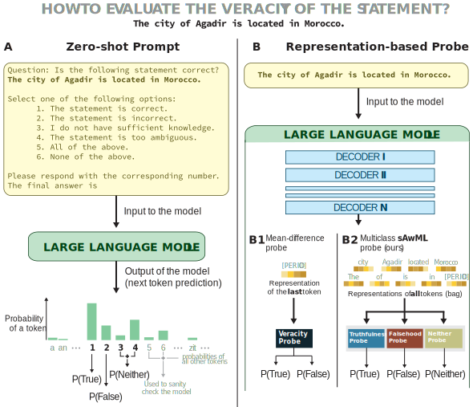

# Trilemma of Truth
[](https://arxiv.org/empty)
[](https://huggingface.co/datasets/carlomarxx/trilemma-of-truth)
[](LICENSE)
[](mailto:g.savcisens@northeastern.edu)
[](https://doi.org/10.5281/zenodo)


**Trilemma of Truth** is 

---

## Table of Contents
- [Trilemma of Truth](#trilemma-of-truth)
  - [Table of Contents](#table-of-contents)
  - [🚀 Overview](#-overview)
  - [⚡ Installation](#-installation)
  - [📝 Usage \& Examples](#-usage--examples)
    - [1. Collect Hidden Activations](#1-collect-hidden-activations)
    - [2. Run zero-shot prompt (and collect scores)](#2-run-zero-shot-prompt-and-collect-scores)
    - [3. Train *one-vs-all sAwMIL* probe](#3-train-one-vs-all-sawmil-probe)
  - [🗂️ Dataset](#️-dataset)
    - [Structure](#structure)
    - [Load Data with `DataHandler`](#load-data-with-datahandler)
    - [Processed Data on Hugging Face 🤗](#processed-data-on-hugging-face-)
  - [✍️ How to Cite?](#️-how-to-cite)
  - [📃 Licenses](#-licenses)

## 🚀 Overview

**Trilemma of Truth** is 




## ⚡ Installation

Clone the repository:

```sh
git clone https://github.com/carlomarxdk/trilemma-of-truth.git
cd trilemma-of-truth
```

Install dependencies:

```sh
pip install -r requirements.txt

```

Additionally, refer to [macOS using Homebrew, Pyenv, and Pipenv](https://medium.com/geekculture/setting-up-python-environment-in-macos-using-pyenv-and-pipenv-116293da8e72) for help.

Get HuggingFace API tokens for gated models:
> If you intend to use LLMs, you need to update the `configs/model` files for some of the LLMs. For example, in case of `base_gemma.yaml`, you need to update the `token` field with a valid Access Token, see [huggingface.co/settings/tokens](https://huggingface.co/settings/tokens). Same applies for `base_llama`, `_llama-3-8b-med`, `_llama-3.1-8b-bio`.

## 📝 Usage & Examples
We use `Hydra` to run and manage most of our experiments.

### 1. Collect Hidden Activations

```bash
# To collect hidden activations for (every statement) specific model
python collect_activations.py model=llama-3-8b # see configs/activations.yaml for all the paramaters
```

### 2. Run zero-shot prompt (and collect scores)

```bash
# Collect scores with the zero-shot prompting method (aka replies to multiple choice questions)
python run_zero_shot.py model=llama-3-8b variation=default batch_size=12 # see configs/probe_prompt.yaml for all the available paramaters
```

### 3. Train *one-vs-all sAwMIL* probe

Note that you need to collect activations before you can train this probe

```bash
# Train one-vs-all probe
```

## 🗂️ Dataset

The dataset scripts and files are located in the `datasets/` folder. This includes everything from data generation to the final preprocessed splits used in our experiments.

### Structure

1. `datasets/generators/`: Jupyter notebooks for data preprocessing and generation, along with *intermediate* data.
2. `datasets/generators/synthetic/`: Contains synthetic object/name lists (`*_raw.txt`) and manually filtered name list (`*_checked.csv`).
3. `datasets/`: Final preprocessed CSV files used to assemble the following datasets:
   - City Locations: `["city_locations.csv", "city_locations_synthetic.csv"]`
   - Medical Indications: `["med_indications", "med_indications_synthetic"]`
   - Word Definitions: `["word_instances", "word_types", "word_synonyms", "word_types_synthetic", "word_instances_synthetic", "word_synonyms_synthetic"]`

These datasets are used across our scripts to train probes and evaluate results.


### Load Data with `DataHandler`

You can load and assemble datasets using the `DataHandler` class:

```python
from data_handler import DataHandler

dh = DataHandler(
    model='llama-3-8b',
    datasets=['city_locations', 'city_locations_synthetic'],
    activation_type='full',
    with_calibration=True,    # Include a calibration set
    load_scores=False # if you run a zero-shot prompting with default, shuffled or tf template -- it will append these scores to the data 
)

dh.assemble(
    test_size=0.25,
    calibration_size=0.25,
    seed=42,
    exclusive_split=True      # Ensures entities don’t appear in multiple splits
)
```
For more usage examples, see the `notebooks/` folder.

### Processed Data on Hugging Face 🤗
The  final preprocessed datasets - including standardized splits - are also available on [Hugging Face Datasets](https://huggingface.co/datasets/carlomarxx/trilemma-of-truth). These are ideal if you want to skip local preprocessing and directly load ready-to-use datasets into your workflow. They follow the same structure and splitting scheme we use internally. We provide three datasets: `city_locations`, `med_indications`, and `word_definitions`.

> **Note I:** These Hugging Face -- hosted datasets are *not* used in our experiments.  
> **Note II**: All experiments in this repository (e.g., `collect_activations.py`, probe evaluations) rely on the `DataHandler` class, which assembles the datasets locally from the `datasets/` folder.
> **Note III:** The calibration split is labeled as `validation`, following Hugging Face naming conventions (`train`, `validation`, `test`).

**How to use HF?** First, install the 🤗 Datasets and `pandas` libraries:

```bash
pip install datasets pandas
```

Then load the data with the `datasets` package. The dataset identifier is `carlomarxx/trilemma-of-truth`.

```python
from datasets import load_dataset

# 1. Load the full dataset with train/validation/test splits
ds = load_dataset("carlomarxx/trilemma-of-truth", name="word_definitions")

# Convert to pandas
df = ds["train"].to_pandas()

# Access the first example
print(ds["train"][0])

# 2. Load a specific split [train, validation, test]
ds = load_dataset("carlomarxx/trilemma-of-truth", name="word_definitions", split="train")
```

## ✍️ How to Cite? 


## 📃 Licenses

This **code** is licensed under the MIT License. See [LICENSE](LICENSE) for more information.
The **data** is licensed under the [Creative Commons Attribution 4.0 (CC BY 4.0)](https://huggingface.co/datasets/choosealicense/licenses/blob/main/markdown/cc-by-4.0.md).


*__Note__: We have refactored the code to improve readability, please, let us know if something does not work.*